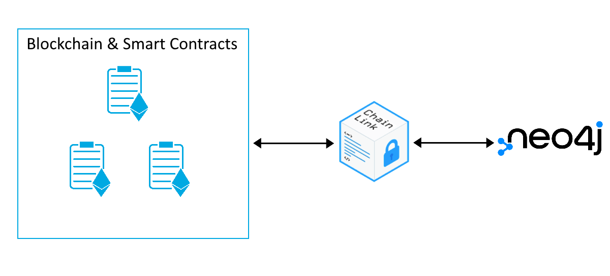
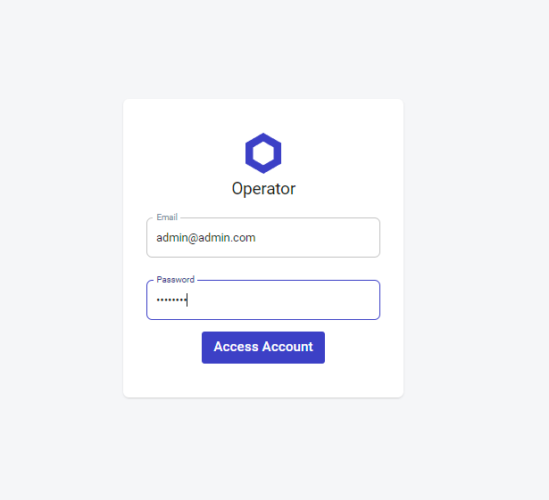
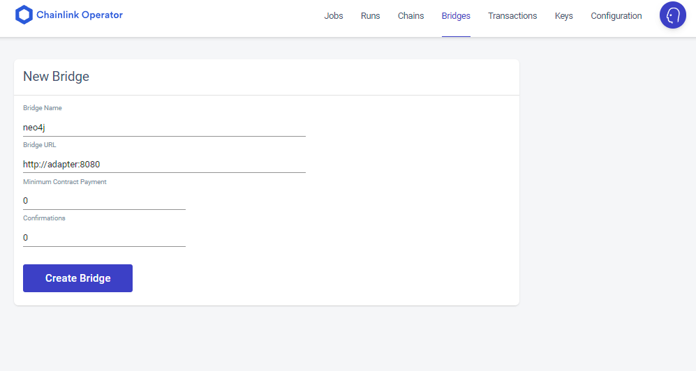
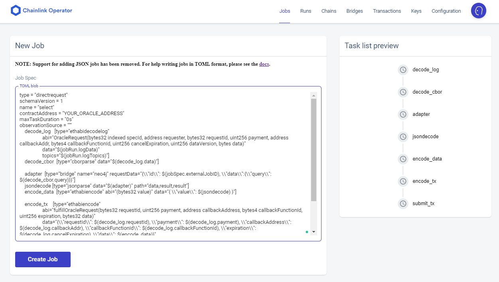

# chainlink-neo4j-adapter

This contains an [external-adapter](https://docs.chain.link/docs/external-adapters/) for the [Neo4j Database](https://neo4j.com/). Host the adapter on your [Chainlink Node](https://docs.chain.link/docs/running-a-chainlink-node/) and query it using [Solidity](https://docs.soliditylang.org/en/v0.8.11/):



## Example Usage

See the entire contract [here](./ExampleContract.sol).

```solidity
using Chainlink for Chainlink.Request;

bytes32 public longestMovieTitle;

uint256 private constant ORACLE_PAYMENT = 1 * LINK_DIVISIBILITY;

function getLongestMovieTitle(address oracle, string memory jobId) public {
    string memory query = "MATCH (m:Movie) "
    "WITH m AS m "
    "ORDER BY size(m.title) DESC "
    "WITH collect(m.title) as list "
    "RETURN { result: head(list) }";

    Chainlink.Request memory req = buildChainlinkRequest(
        stringToBytes32(jobId),
        address(this),
        this.fulfill.selector
    );

    req.add("query", query);

    bytes32 requestId = sendChainlinkRequestTo(oracle, req, ORACLE_PAYMENT);
}

function fulfill(bytes32 requestId, bytes32 answer)
    public
    recordChainlinkFulfillment(requestId)
{
    longestMovieTitle = answer;
}
```

## Getting Started

Following along through the steps will show you how to; get dependencies running, deploy a Oracle contract, deploy a ExampleContract contract and interact with that ExampleContract triggering a call to Neo4j.

Clone this repo:

```
git clone https://github.com/danstarns/chainlink-neo4j-adapter.git
```

- [chainlink-neo4j-adapter](#chainlink-neo4j-adapter)
  - [Example Usage](#example-usage)
  - [Getting Started](#getting-started)
    - [1. Dependencies And Docker](#1-dependencies-and-docker)
      - [1. .env file](#1-env-file)
      - [2 Running Docker](#2-running-docker)
    - [2. Starting The Adapter](#2-starting-the-adapter)
    - [3 Adding Bridge To Chainlink Node](#3-adding-bridge-to-chainlink-node)
    - [4 Deploying Your Oracle](#4-deploying-your-oracle)
    - [5 Adding Job To Chainlink Node](#5-adding-job-to-chainlink-node)
    - [6 Deploying Contract](#6-deploying-contract)
    - [7 Funding Addresses](#7-funding-addresses)
    - [8 Seeding Neo4j](#8-seeding-neo4j)
    - [9 Preforming The Request](#9-preforming-the-request)
  - [License](#license)

### 1. Dependencies And Docker

1. [Chainlink Node](https://docs.chain.link/docs/running-a-chainlink-node/)
   1. [Postgres Database](https://www.postgresql.org/)
2. [Running Adapter](#starting_the_adapter)
   1. [Neo4j Database](https://neo4j.com/)

You can use the docker-compose, in this repo, to setup all dependencies! Follow steps 1. & 2.

#### 1. .env file

You will need to copy the `./.env.example` file to `./.env` and adjust some required configuration:

1. `LINK_CONTRACT_ADDRESS` - The contract address where the LINK token lives.
2. `ETH_CHAIN_ID` - What chain are you on
3. `ETH_URL` - The web socket url to your Ethereum node for example `wss://rinkeby.infura.io/ws/v3/KEY_HERE`

#### 2 Running Docker

```
docker-compose up
```

Now you can skip to [Adding Bridge To Chainlink Node](#adding-bridge-to-chainlink-node)

### 2. Starting The Adapter

> If you are using the docker-compose then skip to [Adding Bridge To Chainlink Node](#adding-bridge-to-chainlink-node).

You will need to have your [Neo4j Database](https://neo4j.com/) running at this point, then you should serve this adapter over HTTP, to do this run:

```
npm install
```

The adapter relies on the environment variables:

1. `EA_PORT` - HTTP port to server adapter on
2. `NEO4J_HTTP_URL`
3. `NEO4J_USER`
4. `NEO4J_PASSWORD`
5. `NEO4J_DB`

To run:

```
npm start
```

### 3 Adding Bridge To Chainlink Node

You will need to have your [Chainlink Node](https://docs.chain.link/docs/running-a-chainlink-node/) running at this point, assuming you use the default config provided navigate to your Chainlink Operator, usually at http://localhost:6688, and login with the credentials:

1. email: admin@admin.com
2. password: password



Once logged in you can now navigate to the `/bridges` page and add a bridge talking to your running adapter.

1. Bridge Name: neo4j
2. Bridge URL `http://adapter:8080`



### 4 Deploying Your Oracle

The Oracle will be a smart contract deployed to the blockchain and serve as an interface between our custom smart contract and thru our Chainlink Node and to this Adapter. Follow [this](https://docs.chain.link/docs/fulfilling-requests/#deploy-your-own-oracle-contract) tutorial and come back with the address of your deployed oracle.

> Do not forget to also [Add your node to the Oracle contract](https://docs.chain.link/docs/fulfilling-requests/#add-your-node-to-the-oracle-contract)

### 5 Adding Job To Chainlink Node

For the purpose of the rest of this documentation we shall use the example of getting the longest title along Movie nodes. For this you should copy the toml below and add it as a job:

> Change `YOUR_ORACLE_ADDRESS` to the address of the deployed oracle contract

```toml
type = "directrequest"
schemaVersion = 1
name = "select"
contractAddress = "YOUR_ORACLE_ADDRESS"
maxTaskDuration = "0s"
observationSource = """
    decode_log   [type="ethabidecodelog"
                  abi="OracleRequest(bytes32 indexed specId, address requester, bytes32 requestId, uint256 payment, address callbackAddr, bytes4 callbackFunctionId, uint256 cancelExpiration, uint256 dataVersion, bytes data)"
                  data="$(jobRun.logData)"
                  topics="$(jobRun.logTopics)"]
    decode_cbor  [type="cborparse" data="$(decode_log.data)"]

    adapter  [type="bridge" name="neo4j" requestData="{\\"id\\": $(jobSpec.externalJobID), \\"data\\":{\\"query\\": $(decode_cbor.query)}}"]
    jsondecode [type="jsonparse" data="$(adapter)" path="data,result,result"]
    encode_data  [type="ethabiencode" abi="(bytes32 value)" data="{ \\"value\\": $(jsondecode) }"]

    encode_tx    [type="ethabiencode"
                  abi="fulfillOracleRequest(bytes32 requestId, uint256 payment, address callbackAddress, bytes4 callbackFunctionId, uint256 expiration, bytes32 data)"
                  data="{\\"requestId\\": $(decode_log.requestId), \\"payment\\": $(decode_log.payment), \\"callbackAddress\\": $(decode_log.callbackAddr), \\"callbackFunctionId\\": $(decode_log.callbackFunctionId), \\"expiration\\": $(decode_log.cancelExpiration), \\"data\\": $(encode_data)}"
                 ]

    submit_tx [type="ethtx" to="YOUR_ORACLE_ADDRESS" data="$(encode_tx)"]

    decode_log -> decode_cbor -> adapter -> jsondecode -> encode_data -> encode_tx -> submit_tx
"""
```



### 6 Deploying Contract

Using the remix tab you used in 'Deploying Your Oracle' [here](https://docs.chain.link/docs/fulfilling-requests/#deploy-your-own-oracle-contract) create a new file called `MyContract.sol` and paste in the Solidity:

```solidity
// SPDX-License-Identifier: MIT
pragma solidity ^0.8.7;

import "@chainlink/contracts/src/v0.8/ChainlinkClient.sol";

contract ExampleContract is ChainlinkClient {
    using Chainlink for Chainlink.Request;

    bytes32 public longestMovieTitle;

    uint256 private constant ORACLE_PAYMENT = 1 * LINK_DIVISIBILITY;

    constructor(address link) {
        setChainlinkToken(link);
    }

    fallback() external payable {}

    receive() external payable {}

    function getLongestMovieTitle(address oracle, string memory jobId) public {
        string memory query = "MATCH (m:Movie) "
        "WITH m AS m "
        "ORDER BY size(m.title) DESC "
        "WITH collect(m.title) as list "
        "RETURN { result: head(list) }";

        Chainlink.Request memory req = buildChainlinkRequest(
            stringToBytes32(jobId),
            address(this),
            this.fulfill.selector
        );

        req.add("query", query);

        bytes32 requestId = sendChainlinkRequestTo(oracle, req, ORACLE_PAYMENT);
    }

    function fulfill(bytes32 requestId, bytes32 answer)
        public
        recordChainlinkFulfillment(requestId)
    {
        longestMovieTitle = answer;
    }

    function stringToBytes32(string memory source)
        private
        pure
        returns (bytes32 result)
    {
        bytes memory tempEmptyStringTest = bytes(source);
        if (tempEmptyStringTest.length == 0) {
            return 0x0;
        }

        assembly {
            // solhint-disable-line no-inline-assembly
            result := mload(add(source, 32))
        }
    }
}
```

Compile this and then deploy it to your chosen network.

### 7 Funding Addresses

Use the faucet to fund your Chainlink Node and Example Contract.

Request testnet LINK and ETH here: https://faucets.chain.link/

### 8 Seeding Neo4j

Navigate to http://localhost:7474/browser/ login:

1. username: neo4j
2. password: test

Then run the seed:

```gql
CREATE (:Movie {title: "The Matrix"})
CREATE (:Movie {title: "The Matrix Reloaded"})
CREATE (:Movie {title: "Forrest Gump"})
```

### 9 Preforming The Request

The request happens here in `ExampleContract.sol`:

```solidity
function getLongestMovieTitle(address oracle, string memory jobId) public {
    string memory query = "MATCH (m:Movie)"
    "WITH m AS m "
    "ORDER BY size(m.title) DESC "
    "WITH collect(m.title) as list"
    "RETURN { result: head(list) }";

    Chainlink.Request memory req = buildChainlinkRequest(
        stringToBytes32(jobId),
        address(this),
        this.fulfill.selector
    );

    req.add("query", query);

    bytes32 requestId = sendChainlinkRequestTo(oracle, req, ORACLE_PAYMENT);
}
```

Use the remix tab to interact with this function, evoke it with your Oracle address and Job id.

To find the Job ID check [http://localhost:6688/jobs/1/definition](http://localhost:6688/jobs/1/definition) and look for `externalJobID`. **Remove the dashes before supplying the jobId in remix.**

Wait some time until all the transactions have happened and check the contracts `longestMovieTitle` property.

## License

MIT
